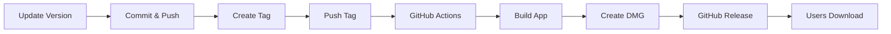

# Container Manager - DMG Packaging 📦

Complete GitHub Actions setup for building and distributing your macOS Container Manager app as a DMG.

## 🎯 Three Ways to Build

### 1️⃣ Local Script (Fastest)
```bash
./scripts/create-dmg.sh 1.0.0
```
**Result:** `container-manager-1.0.0.dmg` in current directory

### 2️⃣ Makefile (Easiest)
```bash
make dmg
```
**Result:** Built, packaged, ready to distribute

### 3️⃣ GitHub Actions (Automated)
```bash
git tag v1.0.0
git push origin v1.0.0
```
**Result:** Automatic build → DMG → GitHub Release

## 🔐 Unsigned vs Signed

### Unsigned (Default)
- ✅ No setup required
- ✅ Fast builds
- ⚠️ Users see "unidentified developer" warning
- ⚠️ Users must right-click → Open
- **Best for:** Testing, internal distribution

### Signed + Notarized
- ✅ No security warnings
- ✅ Double-click to open
- ✅ Professional
- 🔧 Requires Apple Developer account
- 🔧 Requires GitHub Secrets setup
- **Best for:** Public release

## 🚦 Quick Start

1. **Commit the new files:**
   ```bash
   git add .github/ scripts/ *.md Makefile .gitignore
   git commit -m "Add DMG build system"
   git push
   ```

2. **Test locally:**
   ```bash
   make dmg
   open *.dmg
   ```

3. **Create your first release:**
   ```bash
   git tag v1.0.0
   git push origin v1.0.0
   ```

4. **Watch it build:**
   - Go to GitHub → Actions tab
   - Watch the magic happen
   - Download from Releases tab

## 📁 What Was Created

| File | Purpose |
|------|---------|
| `.github/workflows/build-dmg.yml` | Unsigned DMG builder |
| `.github/workflows/build-signed-dmg.yml` | Signed & notarized DMG |
| `.github/workflows/build-test.yml` | CI testing on every push |
| `scripts/create-dmg.sh` | Local DMG build script |
| `Makefile` | Easy build commands |
| `BUILDING.md` | Complete documentation |
| `QUICKSTART-DMG.md` | Quick reference |
| `DMG-SETUP-COMPLETE.md` | This guide |

## 🎨 The User Experience

Your users will:
1. Download `container-manager-1.0.0.dmg`
2. Double-click to open
3. Drag app to Applications folder
4. Launch from Applications
5. Enjoy! 🎉

## 🔧 Optional: Code Signing Setup

Add these GitHub Secrets for signed builds:

```
MACOS_CERTIFICATE          # Your Developer ID cert (base64)
MACOS_CERTIFICATE_PWD      # Certificate password
APPLE_TEAM_ID              # Your Apple Team ID
NOTARIZATION_USERNAME      # Apple ID email
NOTARIZATION_PASSWORD      # App-specific password
```

**How to get certificate:**
```bash
# Export from Keychain Access
# Right-click certificate → Export → Save as .p12
base64 -i certificate.p12 | pbcopy
# Paste into GitHub Secrets
```

## 📊 Workflow Comparison

| Feature | build-dmg.yml | build-signed-dmg.yml | Local Script |
|---------|---------------|----------------------|--------------|
| **Speed** | ~5 min | ~25 min | ~2 min |
| **Setup** | None | Secrets required | None |
| **Output** | Unsigned DMG | Signed DMG | Unsigned DMG |
| **Triggered by** | Tags | Tags | Manual |
| **Creates Release** | Yes | Yes | No |
| **Best for** | Beta testing | Production | Quick testing |

## 🔄 Release Process



1. Update version in Xcode
2. Commit changes
3. Create tag: `git tag v1.0.0`
4. Push tag: `git push origin v1.0.0`
5. GitHub Actions runs automatically
6. DMG appears in Releases
7. Share the link!

## 🎓 Common Commands

```bash
# Build the app
make build

# Run tests  
make test

# Create DMG
make dmg

# Install to Applications
make install

# Clean everything
make clean

# Build and run
make run

# Create release tag interactively
make tag

# See all commands
make help
```

## 🐛 Troubleshooting

**"Scheme not found" error:**
```bash
xcodebuild -list  # See available schemes
```

**App won't open (unsigned):**
1. Right-click app → Open
2. Click "Open" in dialog
3. (First time only)

**GitHub Action fails:**
- Check Actions tab for logs
- Verify scheme name matches
- Try manual trigger first

## 📚 Documentation

- **Quick Start:** [QUICKSTART-DMG.md](QUICKSTART-DMG.md)
- **Full Docs:** [BUILDING.md](BUILDING.md)
- **This File:** [DMG-SETUP-COMPLETE.md](DMG-SETUP-COMPLETE.md)

## ✅ Checklist

- [ ] Commit new files
- [ ] Test locally: `make dmg`
- [ ] Push to GitHub
- [ ] Test GitHub Action manually
- [ ] Create v1.0.0 tag
- [ ] Verify release created
- [ ] Download and test DMG
- [ ] (Optional) Set up code signing
- [ ] Share with users!

## 🎉 You're Ready!

Everything is set up. Choose your path:

**Just testing?**
```bash
make dmg
```

**Ready to ship?**
```bash
git tag v1.0.0
git push origin v1.0.0
```

**Want signing?**
1. Add GitHub Secrets
2. Use `build-signed-dmg.yml`
3. Push a tag

Happy shipping! 🚀

---

**Questions?** Check [BUILDING.md](BUILDING.md) for detailed documentation.
