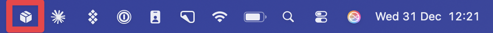
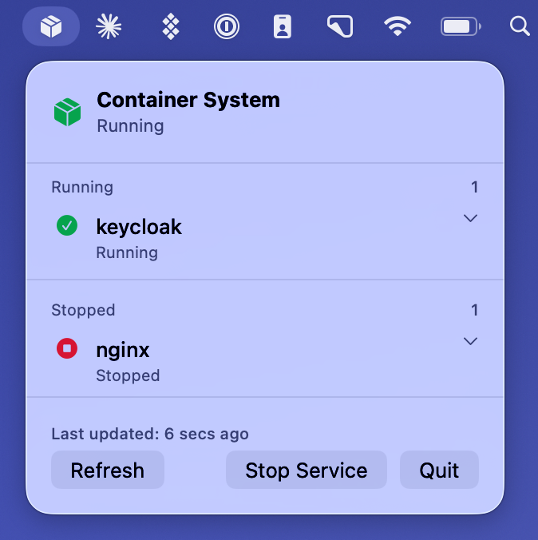
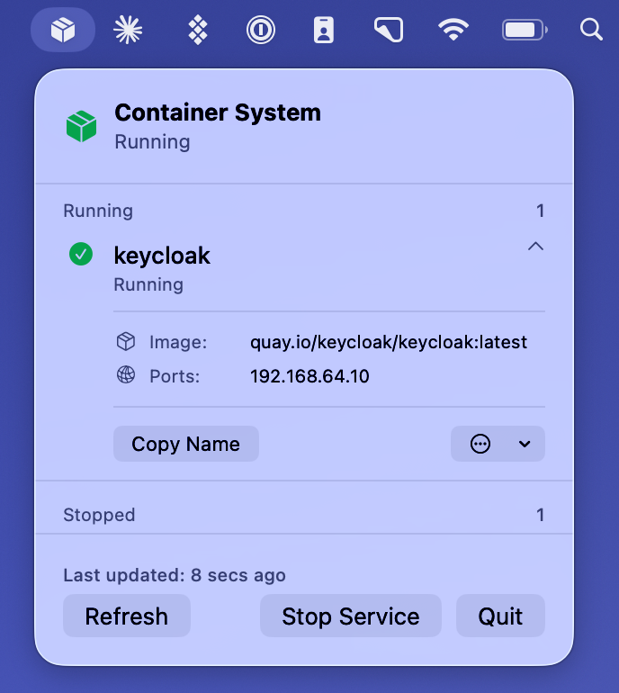
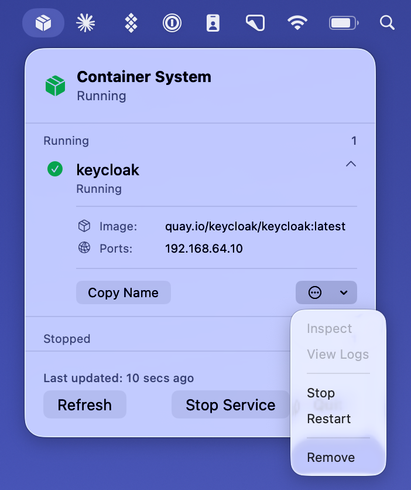

# Container Manager for macOS 📦

A native macOS application for monitoring and managing containers. Built with SwiftUI for a clean, native macOS experience.

**Now featuring a full desktop application!** Use it as a lightweight menu bar app or open the comprehensive desktop interface for advanced management.


## 📸 Screenshots

<p align="center">
  
  <br>
  <em>Container Manager living in your menu bar</em>
</p>

<p align="center">
  
  <br>
  <em>Clean interface showing running and stopped containers</em>
</p>

<p align="center">
  
  <br>
  <em>Expanded container view with detailed information</em>
</p>

<p align="center">
  
  <br>
  <em>Quick actions available for each container</em>
</p>

## ✨ Features

### 🎯 Two Modes of Operation

**Menu Bar Mode** (Lightweight)
- Lives in your menu bar for quick access
- Status monitoring at a glance
- Basic container operations
- Hidden from Dock and App Switcher

**Desktop App Mode** (Comprehensive)
- Full-featured management interface
- Multi-section sidebar navigation (Containers, Images, Volumes, Networks)
- Real-time statistics dashboard
- Advanced filtering and search
- List and grid view modes
- Detailed inspector panel
- Settings and preferences

Press `⌘M` to switch between modes!

### 🎯 Core Functionality
- **Menu Bar App** - Lives in your menu bar, hidden from Dock and App Switcher
- **Container Monitoring** - Real-time monitoring of all containers (running and stopped)
- **Container Management** - Start, stop, restart, and remove containers
- **Container Creation** - Wizard-guided container creation with step-by-step configuration
- **Batch Operations** - Multi-select containers for bulk start, stop, restart, or remove
- **Service Control** - Start and stop the container service
- **Real-time Statistics** - CPU, memory, network, and disk I/O monitoring with live charts
- **Auto-refresh** - Updates every 10 seconds automatically
- **Smart Updates** - Only refreshes when actual changes occur

### 📋 Container List
- **Status Indicators** - Color-coded icons for quick identification
  - 🟢 Green: Running
  - 🔴 Red: Stopped/Exited
  - 🟠 Orange: Paused
  - 🟡 Yellow: Restarting
  - ⚪ Gray: Unknown
- **Expandable Details** - Click any container to see:
  - Image name and tag
  - Port mappings / IP address
  - Creation time
- **Separate Sections** - Running and stopped containers shown separately
- **Container Count** - Shows count for each section

### 🔧 Container Actions
- **Copy Name** - Quick copy to clipboard
- **Start** - Start stopped containers
- **Stop** - Stop running containers
- **Restart** - Restart containers
- **Remove** - Delete containers (with confirmation)
- **Batch Actions** - Select multiple containers for bulk operations
- **Create Container** - 7-step wizard for new container creation
  - Image selection with search and custom image support
  - Basic configuration (name, command)
  - Port mapping configuration
  - Volume mount setup
  - Environment variable management
  - Network configuration
  - Configuration review and confirmation

### ⌨️ Keyboard Shortcuts
- **⌘M** - Open Manager Window (Desktop App)
- **⌘R** - Refresh container list
- **⌘⇧S** - Start/Stop container service
- **⌘,** - Settings
- **⌘F** - Search (in Desktop App)
- **⌘Q** - Quit application

## 🚀 Getting Started

### Requirements
- macOS 14.0 or later
- Xcode 16.0 or later
- Apple's container tool (or Docker/Podman with modifications)

### Building from Source

1. **Clone the repository**
```bash
git clone https://github.com/yourusername/container-manager.git
cd container-manager
```

2. **Open in Xcode**
```bash
open container-manager.xcodeproj
```

3. **Build and Run**
- Press ⌘R or click the Run button
- The app will appear in your menu bar (shipping box icon)

### Installation

After building:
1. The app installs to your Applications folder
2. Look for the shipping box icon in your menu bar
3. Click it to open the container manager

### Creating a Release Build

We use a local build system with proper code signing for releases:

```bash
# For development/testing (unsigned)
make dmg

# For public distribution (signed + notarized)
make dmg-signed
make notarize APPLE_ID=your-email@example.com
make upload-release VERSION=v1.1.0
```

**Documentation:**
- [`SIGNED_RELEASE_GUIDE.md`](SIGNED_RELEASE_GUIDE.md) - Complete guide for signed releases
- [`RELEASE_QUICK_START.md`](RELEASE_QUICK_START.md) - Quick reference for releases
- [`docs/CODE_SIGNING_GUIDE.md`](docs/CODE_SIGNING_GUIDE.md) - Technical code signing reference

**Available Build Targets:**
- `make dmg` - Unsigned DMG for development
- `make dmg-signed` - Signed DMG with Developer ID
- `make notarize` - Submit for Apple notarization
- `make check-signing` - Verify code signing status
- `make upload-release` - Upload to GitHub as draft release

## 🎨 User Interface

### Main Window
```
┌─────────────────────────────────┐
│  📦 Container System            │
│     Running                      │
├─────────────────────────────────┤
│  Running                      2 │
│  ● keycloak                 ⌄  │
│  ● nginx                    ⌄  │
├─────────────────────────────────┤
│  Stopped                      1 │
│  ○ redis-old                ⌄  │
├─────────────────────────────────┤
│  Last updated: 3s ago           │
│  [Refresh]      [Stop Service]  │
│                          [Quit]  │
└─────────────────────────────────┘
```

### Empty States
The app shows helpful messages when:
- **No containers**: "No containers found"
- **Service stopped**: Prompt to start the service
- **Error state**: Clear error message with retry button

## 🔧 Technical Architecture

### Application Modes

The app uses SwiftUI's scene system to provide two interfaces:

**MenuBarExtra Scene:**
- Always visible in menu bar
- Lightweight popup interface
- Quick status monitoring

**Window Scene:**
- Full desktop application
- Opens on-demand via `⌘M`
- Multi-section navigation

Both modes share a single `ContainerSystemMonitor` instance for synchronized state.

### Components

#### `container_managerApp.swift`
- Main app entry point with dual scenes
- Menu bar and window configuration
- App delegate for Dock/menu bar behavior
- Global keyboard shortcuts
- Window management

#### `ContentView.swift`
- Menu bar popup UI
- Container list display
- Running/stopped container sections
- Service control buttons
- "Open Manager" button to launch desktop app

#### Desktop App Views
- **DesktopAppWindow.swift** - Main window with sidebar navigation
- **ContainerListView.swift** - Enhanced list/grid views with inspector
- **ContainerInspectorView.swift** - Detailed container information panel
- **ContainerActions.swift** - Reusable action menus and context menus
- **ContainerCreationView.swift** - 7-step container creation wizard
- **ContainerCreationSteps.swift** - Individual wizard step implementations
- **ContainerCreationConfig.swift** - Configuration data model
- **ImageListView.swift** - Image management interface
- **VolumeListView.swift** - Volume management
- **NetworkListView.swift** - Network management
- **StatsView.swift** - Real-time statistics dashboard with live charts
- **SettingsView.swift** - Application preferences
- **AnimationPreferences.swift** - Accessibility-aware animation controls

#### `ContainerSystemMonitor.swift`
- Container system monitoring
- Executes container commands
- Parses container list output
- Manages container operations (start/stop/restart/remove)
- Smart update detection

### Data Flow

```
Timer (10s) → Monitor → Execute Command → Parse Output → Compare Changes → Update UI
                ↓                                                               ↑
          User Action → Perform Operation → Refresh ─────────────────────────┘
```

### Container Detection

The app searches for container tools in these locations:
- `/usr/local/bin/container`
- `/opt/homebrew/bin/container`
- `/usr/bin/container`
- `~/bin/container`
- `~/.local/bin/container`

### Supported Commands

The app uses these container commands:
- `container ls -a` - List all containers
- `container start <name>` - Start a container
- `container stop <name>` - Stop a container
- `container restart <name>` - Restart a container
- `container delete <name>` - Remove a container (tries `delete`, `rm`, `rm -f`)
- `container system start` - Start container service
- `container system stop` - Stop container service

### Output Parsing

The app parses container output in multiple formats:

**Table Format (Primary)**
```
ID        IMAGE                             OS     ARCH   STATE    ADDR          CPUS  MEMORY
keycloak  quay.io/keycloak/keycloak:latest  linux  arm64  running  192.168.64.5  4     1024 MB
```

**JSON Format (If Available)**
```json
[
  {
    "name": "keycloak",
    "state": "running",
    "image": "quay.io/keycloak/keycloak:latest"
  }
]
```

The parser automatically detects column positions from headers, making it flexible for different output formats.

## 🎯 Configuration

### Polling Interval

Change the auto-refresh interval in `ContainerSystemMonitor.swift`:
```swift
timer = Timer.scheduledTimer(withTimeInterval: 10.0, repeats: true)
// Change 10.0 to your preferred seconds
```

### Window Size

Adjust the popup window size in `ContentView.swift`:
```swift
.frame(width: 300)  // Change width
```

### Max Container List Height

Change the scrollable area height:
```swift
.frame(maxHeight: 350)  // Change max height
```

### Container Tool Path

Add custom paths in `ContainerSystemMonitor.swift`:
```swift
let containerPaths = [
    "/your/custom/path/to/container",
    "/usr/local/bin/container",
    // ... existing paths
]
```

## 🐛 Troubleshooting

### Containers Not Showing

1. **Check container service status**
   - Look at the status indicator in the header
   - Should show "Running" in green

2. **Verify container tool**
   ```bash
   which container
   container ls -a
   ```

3. **Check permissions**
   - App needs permission to execute container commands
   - May need to grant Terminal permissions in System Settings

### Service Won't Start/Stop

1. **Check container tool installation**
   ```bash
   container system status
   ```

2. **Try manually in Terminal**
   ```bash
   container system start
   container system stop
   ```

3. **Check system logs**
   - Open Console.app
   - Filter for "container" or your app name

### Remove Not Working

The app tries multiple removal commands in order:
1. `container delete <name>`
2. `container rm <name>`
3. `container rm -f <name>`

If all fail, try manually:
```bash
container delete <container-name>
# or
container rm -f <container-name>
```

### App Shows in Dock/Switcher

The app should be hidden by default via `NSApp.setActivationPolicy(.accessory)`. If it still appears:

1. **Clean build**
   - Product → Clean Build Folder (⌘⇧K)
   
2. **Verify AppDelegate**
   - Check `container_managerApp.swift` has `AppDelegate` class
   - Verify `.accessory` policy is set

3. **Alternative: Info.plist**
   - Add `LSUIElement` = `YES` to Info.plist

## 🎨 Creating an App Icon

### Option 1: Use SF Symbols (Quick)

1. Open SF Symbols app (included with Xcode)
2. Search for "shippingbox.fill"
3. Export at 1024x1024
4. Use an online tool like [icon.kitchen](https://icon.kitchen) to generate icon set
5. Add to Assets.xcassets → AppIcon

### Option 2: Design Custom Icon

**Specifications:**
- Size: 1024x1024 pixels
- Format: PNG with transparency
- Style: Flat, minimal design
- Colors: Match your app theme

**Required Sizes:**
- 16x16 (1x and 2x)
- 32x32 (1x and 2x)
- 128x128 (1x and 2x)
- 256x256 (1x and 2x)
- 512x512 (1x and 2x)

### Option 3: Use Icon Generator Tools

**Free Tools:**
- [icon.kitchen](https://icon.kitchen)
- [appiconizer.com](https://appiconizer.com)
- [cloudconvert.com](https://cloudconvert.com)

## 🔐 Permissions

The app requires:
- **Network** - To execute container commands
- **File System** - To find container tool binaries

No special entitlements are needed for basic functionality.

## 🚀 Advanced Features

### Smart Update System

The app uses an intelligent update system that:
1. **Pauses during user interactions** - No interruptions while using dialogs
2. **Compares container lists** - Only updates when actual changes occur
3. **Prevents dialog closure** - Confirmation dialogs stay open
4. **Efficient polling** - 10-second interval balances responsiveness and efficiency

### Container State Detection

Status detection is flexible and case-insensitive:

**Running:**
- "running"
- "up"
- Any status containing "running"

**Stopped:**
- "stopped"
- "exited"
- Any status containing "exit"

### Multi-Command Fallback

Operations try multiple command variations for compatibility:

**Remove Operation:**
1. `delete` (Apple's container tool)
2. `rm` (Docker/Podman standard)
3. `rm -f` (Force remove)

## 📊 Performance

- **CPU Usage**: Minimal (~0.1% at idle)
- **Memory**: ~20-30 MB
- **Polling**: Every 10 seconds (configurable)
- **UI Updates**: Only when data changes
- **Response Time**: Instant for UI interactions

## 🛠️ Development

### Project Structure

```
container-manager/
├── container_managerApp.swift          # App entry point
├── ContentView.swift                   # Menu bar popup
├── ContainerSystemMonitor.swift        # Business logic
├── DesktopAppWindow.swift             # Main desktop window
├── ContainerListView.swift            # Enhanced container list
├── ContainerInspectorView.swift       # Inspector panel
├── ContainerActions.swift             # Reusable actions
├── ContainerCreationView.swift        # Container creation wizard
├── ContainerCreationSteps.swift       # Wizard step implementations
├── ContainerCreationConfig.swift      # Configuration model
├── ImageListView.swift                # Image management
├── VolumeListView.swift               # Volume management
├── NetworkListView.swift              # Network management
├── StatsView.swift                    # Statistics dashboard
├── SettingsView.swift                 # Preferences
├── AnimationPreferences.swift         # Accessibility animations
├── LoadingIndicator.swift             # Loading states
├── Assets.xcassets/                   # Images and icons
├── Makefile                           # Build automation
├── scripts/
│   ├── create-dmg.sh                 # DMG creation script
│   └── check-signing.sh              # Code signing verification
├── docs/
│   ├── CODE_SIGNING_GUIDE.md         # Code signing reference
│   └── development/                  # Development docs
├── SIGNED_RELEASE_GUIDE.md           # Release workflow guide
├── CHANGELOG.md                      # Version history
└── Tests/
    ├── ContainerSystemMonitorTests.swift
    ├── NetworkManagementTests.swift
    └── VolumeManagementTests.swift
```

### Testing

Run tests in Xcode:
```bash
⌘U - Run all tests
```

Or from command line:
```bash
xcodebuild test -scheme container-manager
```

### Adding New Container Operations

1. Add method to `ContainerSystemMonitor`:
```swift
func myOperation(named name: String) async -> Bool {
    return await performContainerOperation(
        command: "mycommand",
        containerName: name
    )
}
```

2. Add UI button in `ContentView`:
```swift
Button("My Action") {
    performAction {
        await containerMonitor.myOperation(named: container.name)
    }
}
```

## 🤝 Contributing

Contributions are welcome! Areas for improvement:

### High Priority
- [x] Full desktop application interface
- [x] Enhanced container list with grid/list views
- [x] Inspector panel for detailed information
- [x] Statistics dashboard with live charts
- [x] Settings and preferences
- [x] Container creation wizard (7-step guided process)
- [x] Batch operations for containers
- [x] Code signing and notarization workflow
- [ ] Container log viewer with live streaming
- [ ] Terminal/exec integration
- [ ] Image pull/push with progress
- [ ] Docker/Podman compatibility layer

### Medium Priority
- [ ] Container templates for quick creation
- [ ] Volume browser with file navigation
- [ ] Network configuration UI
- [ ] Compose file support
- [ ] Multi-host support
- [ ] Custom themes/colors
- [ ] Notification support
- [ ] Export container list

### Nice to Have
- [ ] Container groups/favorites
- [ ] Historical statistics
- [ ] Advanced filtering rules
- [ ] Custom actions/scripts
- [ ] Cloud registry integration
- [ ] Team collaboration features

## 📚 Documentation

- **[Desktop App Guide](DESKTOP_APP_GUIDE.md)** - Comprehensive guide to the desktop application
- **[API Documentation](#)** - Code documentation (coming soon)
- **[Contributing Guide](#)** - How to contribute (coming soon)

## 📝 License

This project is licensed under the MIT License - see the [LICENSE](LICENSE) file for details.

Copyright (c) 2026 Andrew Bold

## 🙏 Acknowledgments

- Built with Swift and SwiftUI
- Uses SF Symbols for icons
- Inspired by Docker Desktop and Orbstack

## 📞 Support

- **Issues**: [GitHub Issues](https://github.com/yourusername/container-manager/issues)
- **Discussions**: [GitHub Discussions](https://github.com/yourusername/container-manager/discussions)

## 🗺️ Roadmap

### Version 1.1.0 (Current - February 2026)
- [x] Full desktop application
- [x] Enhanced container list with grid view
- [x] Inspector panel
- [x] Statistics dashboard with live charts
- [x] Settings interface
- [x] Dual-mode operation (menu bar + desktop)
- [x] Container creation wizard (7-step guided process)
- [x] Batch operations for multiple containers
- [x] Code signing and notarization workflow
- [x] Animation preferences with accessibility support

### Version 1.2.0
- [ ] Container log viewer with live streaming
- [ ] Terminal/exec integration
- [ ] Image pull/push interface with progress
- [ ] Container templates for quick creation

### Version 1.3.0
- [ ] Volume browser with file navigation
- [ ] Network configuration UI
- [ ] Docker/Podman auto-detection
- [ ] Historical statistics and analytics

### Version 2.0.0
- [ ] Compose file support
- [ ] Multi-host/remote management
- [ ] Advanced filtering and search
- [ ] Custom actions/scripts
- [ ] Cloud registry integration

---

Made with ❤️ for macOS container management
